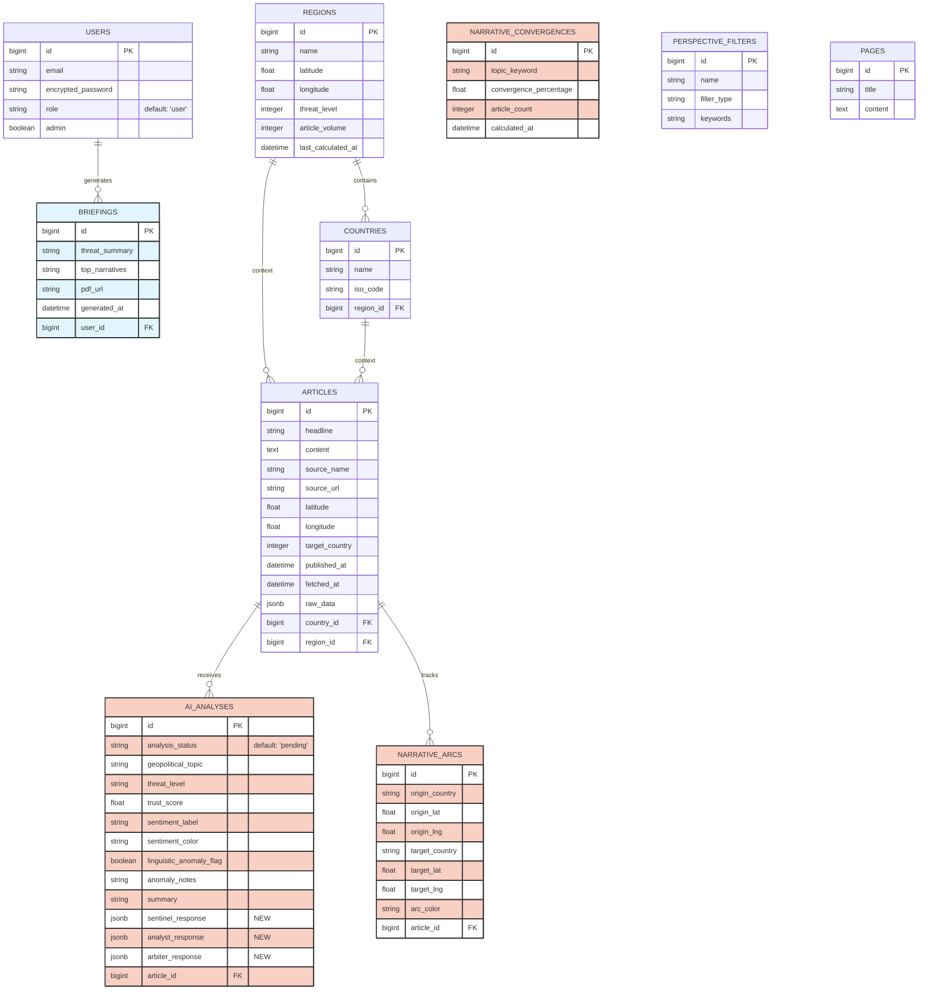

# Veritas DB Schema Update

This diagram displays the current database schema. Tables and fields representing recent core architectural elements—such as geopolitical AI analysis and narrative tracking—are highlighted.

